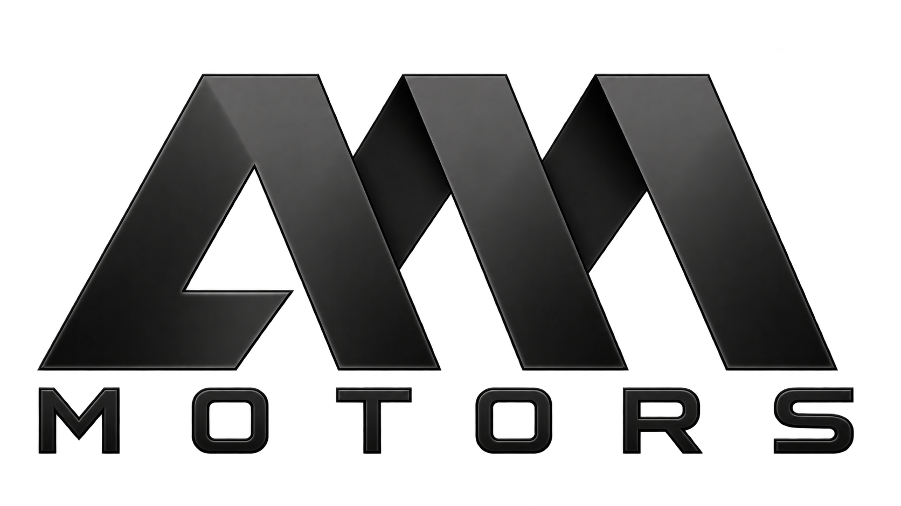

<p align="center">
  <a href="https://ammotors-lb.web.app">
    <picture>
      <source media="(prefers-color-scheme: dark)" srcset="frontend/src/assets/am-motors-logo.png">
      
    </picture>
  </a>
</p>

<h1 align="center">AM MOTORS</h1>

<p align="center">
  A premium digital showroom built for discovering exceptional vehicles in Lebanon.
</p>

<p align="center">
  <a href="https://ammotors-lb.web.app"><strong>Visit the live showroom</strong></a>
  &nbsp;&middot;&nbsp;
  <a href="https://www.instagram.com/a.m_motors_1">Instagram</a>
  &nbsp;&middot;&nbsp;
  <a href="https://www.tiktok.com/@a.mmotors.1">TikTok</a>
</p>

---

## The experience

AM MOTORS brings the dealership online through a fast, cinematic, mobile-first experience. Visitors can explore the current inventory, filter available vehicles, open detailed specifications, browse multi-image galleries, and contact the dealership directly through WhatsApp.

The visual identity stays intentionally refined: bold editorial typography, dark and light themes, premium vehicle photography, and a responsive hero designed to remain smooth even while mobile browser controls expand and collapse.

## Showroom highlights

- Responsive inventory with filtering, pagination, availability, pricing, and mileage
- Detailed vehicle pages with ordered specifications and clear enquiry actions
- Swipeable multi-image galleries with animated transitions, thumbnails, and an accessible fullscreen viewer
- Stable iOS and mobile browser scroll animation without viewport-chrome jumps
- Dark and light themes with theme-aware branding and controls
- Direct WhatsApp, telephone, location, Instagram, and TikTok access
- Resilient loading, image fallbacks, offline-aware caching, and retry states
- Search and sharing metadata with canonical URLs, Open Graph, manifest, favicon, and dealership structured data

## Dealership control

The private administration area keeps inventory management inside the same product. Authorized staff can create, edit, publish, and remove vehicles; manage their specifications; and attach up to 20 hosted or uploaded images per listing.

Administrative access is protected by Firebase Authentication and verified admin claims. Database and storage rules enforce the same permission boundary outside the interface.

## Under the hood

| Layer | Technology |
| --- | --- |
| Experience | React, React Router, Vite |
| Vehicle data | Cloud Firestore |
| Authentication | Firebase Authentication and admin claims |
| Vehicle media | Firebase Storage and hosted image URLs |
| Hosting | Firebase Hosting with GitHub Actions delivery |
| API services | Express and Firebase Admin |
| Quality | Vitest, Testing Library, Node test runner, Firebase rules tests |

```text
Visitors  ──>  React showroom  ──>  Firestore inventory
                         │
                         ├────────>  Vehicle media
                         └────────>  WhatsApp enquiry

Admin     ──>  Secure dashboard ──>  Auth + Firestore + Storage
GitHub    ──>  CI delivery       ──>  Firebase Hosting
```

## Built for production

- Route-level recovery prevents a single rendering failure from breaking the showroom
- Safe asynchronous data handling avoids stale updates during navigation
- Lazy, asynchronously decoded images reduce unnecessary work while scrolling
- A deliberately bounded service-worker cache avoids uncontrolled storage growth
- Production API origins fail closed, authenticated writes validate content types, and readiness is observable
- Keyboard focus is contained and restored correctly in the fullscreen gallery
- Public pages receive contextual titles and descriptions while the admin area remains excluded from indexing

## Project map

```text
AMMOTORS/
├── frontend/    Public showroom and administration interface
├── backend/     Protected inventory API and Firebase Admin services
├── .github/     Hosting delivery workflows
└── firebase.*   Hosting, database, and storage configuration
```

---

<p align="center">
  <strong>Driven by quality.</strong><br>
  AM MOTORS &middot; Lebanon
</p>
